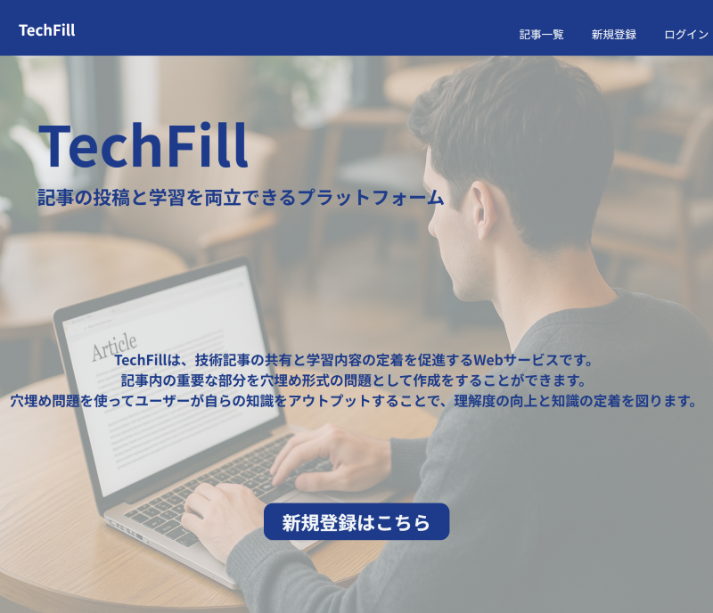
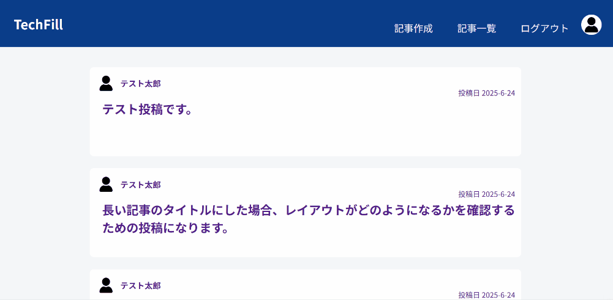
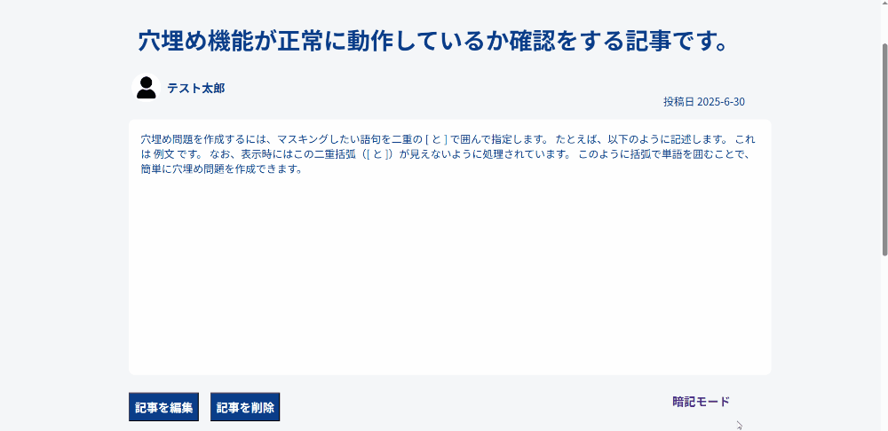

# TechFill

## サービス概要
**TechFill** は、技術記事の投稿・閲覧に加えて、アウトプットを促す「穴埋め問題モード」を搭載した学習支援プラットフォームです。  
Qiita や Zenn のような技術共有サイトの「読む」だけにとどまらず、**学んだことを定着させる仕組み**として、暗記モードを備えています。

## 開発背景・目的

QiitaやZennといった技術情報サイトには、プログラミング言語の解説や環境構築の手順など、学習に役立つ情報が数多く投稿されています。  
私自身もNeuroDiveでの学習中に、こうした記事を参考にして問題解決を行うことが多くありました。

しかし、読んだだけでは内容をすぐに忘れてしまうという課題を感じていました。  
特に、動画や記事といったインプット中心の学習では、専門用語の理解が曖昧になり、結果として知識が定着しづらくなります。

また、アウトプットの重要性は理解していても、いきなり技術記事を書いたり、サービスを開発したりすることは初心者にとってはハードルが高く大きな障壁になります。

そこで私は、まず技術記事を投稿・共有できるWebサービスを開発し、さらに投稿された記事をもとに **「穴埋め問題」形式で復習できる機能**を追加しました。  
これにより、誰でも気軽にアウトプットに取り組みながら、効率的に学習内容を定着させられる環境を目指しています。

## 主な機能

| 機能カテゴリ | 内容 |
|--------------|------|
| ユーザー管理 | 新規登録／ログイン／ログアウト |
| 記事機能 | 投稿／編集／削除／一覧・詳細表示 |
| コメント機能 | 記事へのコメント投稿・閲覧 |
| 閲覧モード切替 | 閲覧モード ↔ 暗記モード（URLパラメータで切替） |
| アクセス制御 | ログイン状態や投稿者に応じた制限 |
| UI／UX | 共通ヘッダーによるナビゲーション設計と視認性の向上 |

### 記事一覧

### 通常モードと暗記モードの切り替え

## 使用技術

| 分類 | 技術スタック / バージョン |
|------|-----------------------------|
| 言語 | Ruby 3.4.2 |
| フレームワーク | Ruby on Rails 8.0.2 |
| フロントエンド | HTML / CSS / ERB（Railsテンプレート） |
| データベース | PostgreSQL 16（Docker コンテナ上） |
| 仮想化環境 | Docker 28.0.4 / Docker Compose 3.9 |
| バージョン管理 | Git 2.43.0 |
| 開発環境 | WSL2 + VSCode（Windows環境） |

## 詳細資料

より詳しい技術選定理由や実装時の工夫・苦労した点などは、以下の資料にまとめています。

## 最後に

TechFillは、**「読むだけで終わらない学習」**を実現することを目指して開発しました。  
今後も機能の拡張やリファクタリングを通じて、より実用的なWebサービスへと進化させていきたいと考えています。
